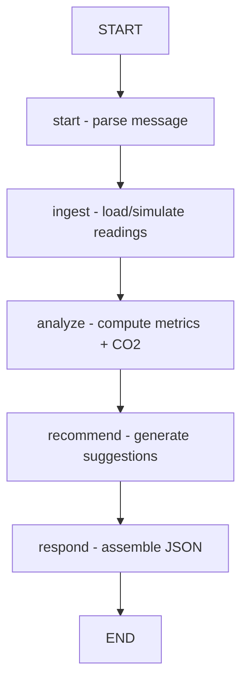

# 🌱 Sustainability Footprint Agent (SFA)

**LangGraph-powered AI agent for energy, water, and gas sustainability insights**  
Built as part of the **Smart Living & Environment Multi-Agent System**.

The SFA analyzes household consumption, computes sustainability metrics, estimates CO₂ emissions, and generates actionable recommendations.  
It communicates using a **standard JSON handshake** so the Supervisor Agent can route user intents seamlessly.

## 🚀 Features

### ✓ LangGraph Autonomous Workflow
The SFA operates as a **LangGraph state machine**:

```
START → start → ingest → analyze → recommend → respond → END
```

Each node updates the agent state and ensures a deterministic flow.

### ✓ Energy, Water, Gas Metrics
The agent computes:
- Total consumption  
- CO₂ emission estimation  
- Efficiency scoring  
- Peak vs off-peak profiling  

### ✓ Actionable Recommendations
Examples:
- "Reduce standby power consumption by turning off idle appliances."
- "Shift washing/laundry to off-peak night hours."
- "Water usage spikes detected — check for possible leaks."

### ✓ Standard Handshake (SPM Contract)

**Request (`AgentRequest`)**
```json
{
  "messages": [
    { "role": "user", "content": "Show my last 7 days energy usage" }
  ]
}
```

**Response (`AgentResponse`)**
```json
{
  "agent_name": "SFA",
  "status": "success",
  "data": {
    "message": "Energy usage over last 7 days: 42.1 kWh...",
    "metrics": { },
    "recommendations": [ ]
  }
}
```

## 📁 Project Structure

```
sfa-agent/
├── app/
│   ├── main.py              # FastAPI app + endpoints
│   ├── models.py            # Pydantic models (AgentRequest/Response)
│   ├── analysis.py          # energy metrics, CO2 calc, recommendations
│   ├── ingest.py            # ingestion + hourly simulation
│   └── config.py            # settings, thresholds
├── tests/
│   ├── test_analysis.py     # unit tests
│   └── test_api.py          # API integration tests
├── docker/
│   └── Dockerfile           # container for HuggingFace deployment
├── scripts/
│   └── simulate_data.py     # generate demo consumption data
├── README.md
└── requirements.txt
```

## ⚙️ Installation

```bash
git clone https://github.com/<your-org>/sfa-agent
cd sfa-agent
pip install -r requirements.txt
```

## ▶️ Running the API

```bash
uvicorn app.main:app --reload --port 8000
```

### API Endpoint
```
http://localhost:8000/sfa/run
```

### Example Request
```bash
curl -X POST http://localhost:8000/sfa/run \
  -H "Content-Type: application/json" \
  -d '{ "messages": [{ "role": "user", "content": "last 3 days usage" }] }'
```

## 🧪 Testing

Run all tests:
```bash
pytest -q
```

### Test Coverage

| Test File | Description |
|-----------|-------------|
| `test_analysis.py` | metrics, scoring, CO₂ calculations |
| `test_api.py` | API integration + handshake validation |

## 🏗️ Deployment

### Docker Build
```bash
docker build -t sfa-agent -f docker/Dockerfile .
docker run -p 8000:8000 sfa-agent
```

### Deploy to Hugging Face
Add:
- `huggingface.yml`
- `Dockerfile`
- `requirements.txt`
- `main.py`

Then push:
```bash
git push
```

HF will auto-build and host your API.

## 📊 LangGraph Architecture



## 🧩 Integration With Supervisor Agent

The Supervisor:
- Detects user intent
- Routes request to SFA
- Receives standardized response

Example registry:
```json
{
  "name": "SFA",
  "route": "http://localhost:8000/sfa/run",
  "description": "Sustainability Footprint Agent"
}
```

## 🛠 Scripts

Generate demo data:
```bash
python scripts/simulate_data.py --days 5 --export ./demo.json
```

## 📜 License

MIT License — free for academic use.

## 🙌 Contributors

- **Sajad Ahmed**
- **Saif-ur-Rehman**

**Supervisor**: Smart Living & Environment Agent Team

---

*Part of the Smart Living & Environment Multi-Agent System*